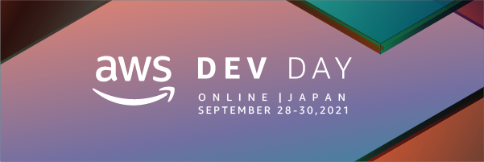

# AWS Dev Day Online Japan 2021 Call for Papers

  

本イベントへの CfP 応募は 2021年8月17日(火) 23:59 JST を以って締め切りました。たくさんのご応募ありがとうございました。

<a href="https://aws.amazon.com/jp/about-aws/events/2021/devday/" target="_blank">AWS Dev Day Online Japan 2021</a> は 2021年9月28日(火)～30日(木) の3日間、以下のタイムテーブルで開催予定です。

:rocket: <a href="https://pages.awscloud.com/AWS-Dev-Day-Online-Japan-2021-registration.html" target="_blank">**AWS Dev Day Online Japan 2021 参加登録はこちらから！**</a>:rocket:

## Day1 - 2021/9/28(火)

<table>
  <thead>
    <tr>
      <th colspan="2">開始・終了時刻 (JST)</th>
      <th>トラック A</th>
      <th>トラック B</th>
      <th>トラック C</th>
    </tr>
  </thead>
  <tbody>
    <tr>
      <td>1:00 PM</td><td>2:00 PM</td>
      <td align="center" colspan="3"><a href="https://aws.amazon.com/jp/about-aws/events/2021/devday/" taget="_blank">CTO と語る 『なぜ Developer はビジネスを理解すべきなのか』</a>  太田 一樹 氏 トレジャーデータ (Treasure Data, Inc.) CEO / 塚田 朗弘 (アマゾン ウェブ サービス ジャパン株式会社 Head of Startup Solutions Architect)</td>
    </tr>
    <tr>
      <td>2:15 PM</td><td>2:55 PM</td>
      <td>A-1 ゼロから始めるAppSync導入の軌跡と振り返り 〜課題も添えて〜 <a href="https://github.com/aws-events/aws-dev-day-online-japan-2021-cfp/issues/19">#19</a> / <a href="https://twitter.com/overgoro56" target="_blank">@overgoro56</a></td>
      <td>B-1 調整中</td>
      <td>C-1 プログラミング学習サービスのこれまでを支えてきた技術と、これからを創っていく技術 <a href="https://github.com/aws-events/aws-dev-day-online-japan-2021-cfp/issues/32">#32</a> / <a href="https://twitter.com/kzk_maeda" target="_blank">@kzk_maeda</a></td>
    </tr>
    <tr>
      <td>3:10 PM</td><td>3:50 PM</td>
      <td>A-2 Lambda だけじゃもったいない。サーバーレス開発の第二歩目を踏み出そう <a href="https://github.com/aws-events/aws-dev-day-online-japan-2021-cfp/issues/64">#64</a> / <a href="https://twitter.com/hassaku_63" target="_blank">@hassaku_63</a></td>
      <td>B-2 AWSにおけるアプリチームとインフラチームのコワーク設計 <a href="https://github.com/aws-events/aws-dev-day-online-japan-2021-cfp/issues/58">#58</a> / <a href="https://twitter.com/msy78" target="_blank">@msy78</a></td>
      <td>C-3 AWS CDKはどう使いこなすのか、初期開発から運用までのノウハウ <a href="https://github.com/aws-events/aws-dev-day-online-japan-2021-cfp/issues/28">#28</a> / <a href="https://twitter.com/tmk2154" target="_blank">@tmk2154</a></td>
    </tr>
    <tr>
      <td>4:05 PM</td><td>4:45 PM</td>
      <td>A-3 AWS Chalice 再入門 〜RESTful APIはやっぱり最高〜 <a href="https://github.com/aws-events/aws-dev-day-online-japan-2021-cfp/issues/50">#50</a> / <a href="https://twitter.com/kimyan_udon2" target="_blank">@kimyan_udon2</a></td>
      <td>B-3 創業3年のSaaSスタートアップが規模急拡大に対してアーキテクチャを変革していった話 <a href="https://github.com/aws-events/aws-dev-day-online-japan-2021-cfp/issues/59">#59</a> / <a href="https://twitter.com/showmant_" target="_blank">@showmant_</a></td>
      <td>C-3 [AWS CDK] 1,000+のCloudWatch Alarmsを自動生成する技術 - 初めてのCDKからマルチアカウントまで！ <a href="https://github.com/aws-events/aws-dev-day-online-japan-2021-cfp/issues/46">#46</a> / <a href="https://twitter.com/xhiroga" target="_blank">@xhiroga</a></td>
    </tr>
    <tr>
      <td>5:00 PM</td><td>5:40 PM</td>
      <td>A-4 2021年版、サーバーレスのテスト手法を考える <a href="https://github.com/aws-events/aws-dev-day-online-japan-2021-cfp/issues/2">#2</a> / <a href="https://twitter.com/_kensh" target="_blank">@_kensh</a></td>
      <td>B-4 AWSを活用した非同期的Webアプリケーション開発のナレッジ <a href="https://github.com/aws-events/aws-dev-day-online-japan-2021-cfp/issues/17">#17</a> / <a href="https://twitter.com/yukiozasa" target="_blank">@yukiozasa</a></td>
      <td>C-4 Amazon Pay for Alexa + ブロックチェーンを使った寄付アプリを実装 <a href="https://github.com/aws-events/aws-dev-day-online-japan-2021-cfp/issues/4">#4</a> / <a href="https://twitter.com/johna1203" target="_blank">@johna1203</a></td>
    </tr>
    <tr>
      <td>5:55 PM</td><td>6:35 PM</td>
      <td>A-5 [AWS Startup ゼミ] よくある課題を一気に解説！ 御社の技術レベルがアップする 2021 秋期講習 <a href="https://github.com/aws-events/aws-dev-day-online-japan-2021-cfp/issues/31">#31</a> / <a href="https://twitter.com/mats16k" target="_blank">@mats16k</a></td>
      <td>B-5 調整中</td>
      <td>C-5 AWSサーバーレスが支える劇団ノーミーツのオンライン劇場 <a href="https://github.com/aws-events/aws-dev-day-online-japan-2021-cfp/issues/48">#48</a> / <a href="https://twitter.com/gagagahaku" target="_blank">@gagagahaku</a></td>
    </tr>
  </tbody>
</table>

## Day2 - 2021/9/29(水)

<table>
  <thead>
    <tr>
      <th colspan="2">開始・終了時刻 (JST)</th>
      <th>トラック D</th>
      <th>トラック E</th>
      <th>トラック F</th>
    </tr>
  </thead>
  <tbody>
    <tr>
      <td>1:00 PM</td><td>2:00 PM</td>
      <td align="center" colspan="3"><a href="https://aws.amazon.com/jp/about-aws/events/2021/devday/" taget="_blank">オーナーシップを持って開発をリードするために必要なこと</a>  Eugene Kawamoto (Director of Product Management, Amazon Redshift, Amazon Web Services, Inc.) / 和智 大二郎（Developer Relations Engineer(Mobile/Web))</td>
    </tr>
    <tr>
      <td>2:15 PM</td><td>2:55 PM</td>
      <td>D-1 SageMakerとStepFunctionsを用いてMLOpsへの一歩を踏み出そう <a href="https://github.com/aws-events/aws-dev-day-online-japan-2021-cfp/issues/56">#56</a> / <a href="https://twitter.com/takapy0210" target="_blank">@takapy0210</a></td>
      <td>E-1 Amazon Auroraを活用したソーシャルゲームの複数ワールドデータ統合 <a href="https://github.com/aws-events/aws-dev-day-online-japan-2021-cfp/issues/14">#14</a> / <a href="https://twitter.com/fujiwara" target="_blank">@fujiwara</a></td>
      <td>F-1 AWS Proton を使って(もらって)快適な開発環境をあげよう(もらおう)！ <a href="https://github.com/aws-events/aws-dev-day-online-japan-2021-cfp/issues/5">#5</a> / <a href="https://twitter.com/yaggytter" target="_blank">@yaggytter</a></td>
    </tr>
    <tr>
      <td>3:10 PM</td><td>3:50 PM</td>
      <td>D-2 AWS Batchを用いた機械学習の分散推論 <a href="https://github.com/aws-events/aws-dev-day-online-japan-2021-cfp/issues/15">#15</a> / <a href="https://twitter.com/taka_nigoro" target="_blank">@taka_nigoro</a></td>
      <td>E-2 LayerXインボイスのAI-OCRを支える非同期処理アーキテクチャ <a href="https://github.com/aws-events/aws-dev-day-online-japan-2021-cfp/issues/37">#37</a> / <a href="https://twitter.com/shun_tak" target="_blank">@shun_tak</a></td>
      <td>F-2 Kubernetes のカスタムコントローラーを読み解く - AWS Controllers for Kubernetes Deep Dive - <a href="https://github.com/aws-events/aws-dev-day-online-japan-2021-cfp/issues/34">#34</a> / <a href="https://twitter.com/track3jyo" target="_blank">@track3jyo</a></td>
    </tr>
    <tr>
      <td>4:05 PM</td><td>4:45 PM</td>
      <td>D-3 あなたのGPUちゃんと回っていますか？：クラウドでの機械学習のボトルネック特定と最適化 <a href="https://github.com/aws-events/aws-dev-day-online-japan-2021-cfp/issues/33">#33</a> / <a href="https://twitter.com/triwave33" target="_blank">@triwave33</a></td>
      <td>E-3 Step Functions×AWS SAMで実現する家族ノートの低運用コストETL基盤 <a href="https://github.com/aws-events/aws-dev-day-online-japan-2021-cfp/issues/41">#41</a> / <a href="https://twitter.com/shnagai" target="_blank">@shnagai</a></td>
      <td>F-3 アプリケーション開発者は Amazon ECS あるいは Kubernetes のどこまでを知っていればいいのか <a href="https://github.com/aws-events/aws-dev-day-online-japan-2021-cfp/issues/16">#16</a> / <a href="https://twitter.com/toricls" target="_blank">@toricls</a></td>
    </tr>
    <tr>
      <td>5:00 PM</td><td>5:40 PM</td>
      <td>D-4 【スポンサーセッション】インテルAIの優れたコストパフォーマンスを最大限に引き出す <a href="https://aws.amazon.com/jp/about-aws/events/2021/devday/" taget="_blank">詳細</a></td>
      <td>E-4 ボケて電笑戦技術解説 ～AIは人を笑わせられるのか？ 挑戦を支える技術とAWS～ <a href="https://aws.amazon.com/jp/about-aws/events/2021/devday/" taget="_blank">詳細</a></td>
      <td>F-4 Amazon ECS Anywhere と機械学習 〜 ハイブリッド環境でのモデルの構築と推論 <a href="https://github.com/aws-events/aws-dev-day-online-japan-2021-cfp/issues/38">#38</a> / <a href="https://twitter.com/literalice" target="_blank">@literalice</a></td>
    </tr>
    <tr>
      <td>5:55 PM</td><td>6:55 PM</td>
      <td align="center" colspan="3">スペシャルプログラム  <a href="https://aws.amazon.com/jp/about-aws/events/2021/devday/" taget="_blank">ボケて電笑戦</a></td>
    </tr>
  </tbody>
</table>

## Day3 - 2021/9/30(木)

<table>
  <thead>
    <tr>
      <th colspan="2">開始・終了時刻 (JST)</th>
      <th>トラック G</th>
      <th>トラック H</th>
      <th>トラック I</th>
    </tr>
  </thead>
  <tbody>
    <tr>
      <td>1:00 PM</td><td>2:00 PM</td>
      <td align="center" colspan="3"><a href="https://aws.amazon.com/jp/about-aws/events/2021/devday/" taget="_blank">Developer が考慮すべきセキュリティ</a>  岡田 良太郎 氏 (株式会社アスタリスクリサーチ エグゼクティブアドバイザ/代表取締役 総務省サイバー演習CYDER委員) / 金森 政雄 (アマゾン ウェブ サービス ジャパン株式会社ソリューション アーキテクト)</td>
    </tr>
    <tr>
      <td>2:15 PM</td><td>2:55 PM</td>
      <td rowspan="2">G-1/G-2 パネルディスカッション：ドメイン駆動設計のマイクロサービスへの活用とデベロッパーに求められるスキル <a href="https://aws.amazon.com/jp/about-aws/events/2021/devday/" taget="_blank">詳細</a></td>
      <td>H-1 AWS Amplifyを軸にしたフルサーバーレスなアプリケーション構成 <a href="https://github.com/aws-events/aws-dev-day-online-japan-2021-cfp/issues/35">#35</a> / <a href="https://twitter.com/seike460" target="_blank">@seike460</a></td>
      <td>I-1 やはりタグ タグは全てを解決する - Tagging Everything <a href="https://github.com/aws-events/aws-dev-day-online-japan-2021-cfp/issues/65">#65</a> / <a href="https://twitter.com/ken5scal" target="_blank">@ken5scal</a></td>
    </tr>
    <tr>
      <td>3:10 PM</td><td>3:50 PM</td>
      <td>H-2 Lambda@EdgeからCloudFront Functionsへの移行とCI / CDパイプラインの整備 <a href="https://github.com/aws-events/aws-dev-day-online-japan-2021-cfp/issues/8">#8</a> / <a href="https://twitter.com/hide__dev" target="_blank">@hide__dev</a></td>
      <td>I-2 「それ、どこに出しても恥ずかしくないTerraformコードになってるか？」 <a href="https://github.com/aws-events/aws-dev-day-online-japan-2021-cfp/issues/57">#57</a> / <a href="https://twitter.com/yshd" target="_blank">@yshd</a></td>
    </tr>
    <tr>
      <td>4:05 PM</td><td>4:45 PM</td>
      <td>G-3 EC2をあきらめない、EC2を活用したアプリ実行基盤のモダンな運用を考える(2021年版) <a href="https://github.com/aws-events/aws-dev-day-online-japan-2021-cfp/issues/25">#25</a> / <a href="https://twitter.com/cyberarchitect" target="_blank">@cyberarchitect</a></td>
      <td>H-3 AWSでISRの実現、その謎を解明すべくAmazonの奥地へと足を踏み入れる <a href="https://github.com/aws-events/aws-dev-day-online-japan-2021-cfp/issues/30">#30</a> / <a href="https://twitter.com/Keisuke69" target="_blank">@Keisuke69</a></td>
      <td>I-3 SLOを活用した技術的改善 <a href="https://github.com/aws-events/aws-dev-day-online-japan-2021-cfp/issues/18">#18</a> / <a href="https://twitter.com/Juju_62q" target="_blank">@Juju_62q</a></td>
    </tr>
    <tr>
      <td>5:00 PM</td><td>5:40 PM</td>
      <td>G-4 ネットワークはなぜつながらないのか 〜インフラの意味論的検査を目指して〜 <a href="https://github.com/aws-events/aws-dev-day-online-japan-2021-cfp/issues/53">#53</a> / <a href="https://twitter.com/y_taka_23" target="_blank">@y_taka_23</a></td>
      <td>H-4 なぜIoTは難しそうに見えてしまうのか <a href="https://github.com/aws-events/aws-dev-day-online-japan-2021-cfp/issues/51">#51</a> / <a href="https://twitter.com/sparkgene" target="_blank">@sparkgene</a></td>
      <td>I-4 AWSでスケーラビリティとレジリエンスを実現するアーキテクチャを考える <a href="https://github.com/aws-events/aws-dev-day-online-japan-2021-cfp/issues/29">#29</a> / <a href="https://twitter.com/j5ik2o" target="_blank">@j5ik2o</a></td>
    </tr>
    <tr>
      <td>5:55 PM</td><td>6:55 PM</td>
      <td align="center" colspan="3">調整中</td>
    </tr>
  </tbody>
</table>

:rocket: <a href="https://pages.awscloud.com/AWS-Dev-Day-Online-Japan-2021-registration.html" target="_blank">**AWS Dev Day Online Japan 2021 参加登録はこちらから！**</a>:rocket:

## AWS Dev Day Online Japan とは

AWS Dev Day Online Japan は、AWS がご提供する新たな時代をリードする開発者の皆様のための、年に一度の技術の祭典です。今押さえておくべき技術領域を幅広く網羅したテクニカルセッション、実践的な経験事例セッションなどを原則としてライブでお届けします。2021年は特に「ライブ」にこだわり、ライブコーディング、ライブデモ、そしてライブ Q&A を多数備え、参加者の皆様ともっとつながることができたらと考えています。ぜひ、ご期待ください。

* 開催日程：2021年9月28日(火) ～ 30日(木) (3日間) 10:00　～ 18:30 (時間については変更になる可能性があります)
* 開催形態：オンライン
* イベント構成：ゼネラルセッション、ブレイクアウトセッション、スペシャルセッション、ワークショップ
* 参加対象：アプリケーション開発、ソフトウェア開発に携わる開発者、エンジニアの皆様

  
<b>CfP 募集要項 (CfP 募集期間は終了しました)</b>

AWS がご提供する開発者のための技術の祭典「AWS Dev Day Online Japan」では幅広く開発者の皆様から経験事例を発表していただく「Call for Papers」をプログラムに取り入れています。 みなさまが培われたご経験、知見、そしてノウハウをぜひこの場で共有していただけませんか？
ご応募をご検討いただける場合は下記募集要項をご確認いただき、[こちらのフォーム](https://github.com/aws-events/aws-dev-day-online-japan-2021-cfp/issues/new/choose)をご利用の上ご応募ください。
なお、ご応募いただいたのち、選考を経て採否を決定させていただきます。予めご了承ください。

:pencil: [セッション応募フォームはこちら](https://github.com/aws-events/aws-dev-day-online-japan-2021-cfp/issues/new/choose)

:rocket: [現在の応募済みセッション一覧はこちら](https://github.com/aws-events/aws-dev-day-online-japan-2021-cfp/issues)

### 応募条件

1. AWS を使った開発に関するトピックであること
2. AWS DevDay 会期中 (2021年 9月28日~30日 のいずれの日程および時間帯 (13:30 ～ 18:45)でもプレゼンテーションできること、もしくは事前収録できること
3. 下記に定義したテーマや技術トピックのいずれかに、開発者の視点から関係していること (複数にまたがっていても問題ありません)
  - テーマ
    - Web フロントエンド開発
    - Web バックエンド / サーバーサイド開発
    - モバイル / ネイティブアプリケーション開発
    - 機械学習モデル開発
    - DevOps / Infrastructure as Code
    - プログラミング
    - アプリケーションアーキテクチャー
    - ソフトウェアテスト
    - エンジニアリングプロセス
    - エンジニアのキャリア
    - エンジニア組織のカルチャー
  - テクノロジートピック
    - サーバーレス
    - コンテナ
    - フロントエンド
    - AI / 機械学習
    - データベース
    - アナリティクス
    - IoT
    - ロボティクス
    - ブロックチェーン
4. 有効とみなされたご応募について、**セッションタイトル、アブストラクト、Twitter ID などの応募内容が GitHub 上で公開され、SNS を介してシェアされることに同意していただけること。**
5. Twitter ダイレクトメッセージを利用した事務局とのコミュニケーションが可能であること
6. プレゼンテーションの後で Ask the Speaker に参加していただけること
7. セッション資料を事前(9月17日まで)に提出していただけること
8. セッション資料の会期後の公開(投影用と多少異なっていてもかまいません)、動画の公開に同意していただけること
9. [イベント登録規約](https://aws.amazon.com/events/terms/)、および [AWS 行動規範 Code of Conduct](https://aws.amazon.com/codesofconduct/) に同意していること（応募フォームで同意の意思表示を行う）

### セッション時間

40分

### 応募締切

2021 年 8月 17 日（火）23:59 JST

### 選考方法

1. AWS Dev Day Online Japan コアメンバーによる審査
2. **SNS での反響（GitHub へのリアクションや Twitter のいいね数、RT数など）**

1, 2 を総合的に判断し、採否を決定いたします

### 選考結果のお知らせ

2021 年 8 月 19 日（木）前後を予定しております。  
選考結果につき、セッション応募時にご入力いただいた Twitter ID へのダイレクトメッセージにてご連絡いたします。

### 過去のAWS Dev Day Online CFP 採択セッションの例 (AWS Dev Day Online Japan 2020)

[こちらから2020年開催の同様のイベントでの CFP 採択セッションの例](https://aws.amazon.com/jp/about-aws/events/2020/devday/)をご覧いただくことができます (要登録)。ぜひご活用ください

:pencil: [セッション応募フォームはこちら](https://github.com/aws-events/aws-dev-day-online-japan-2021-cfp/issues/new/choose)

:rocket: [現在の応募済みセッション一覧はこちら](https://github.com/aws-events/aws-dev-day-online-japan-2021-cfp/issues)

皆様のご応募を心よりお待ちしております

